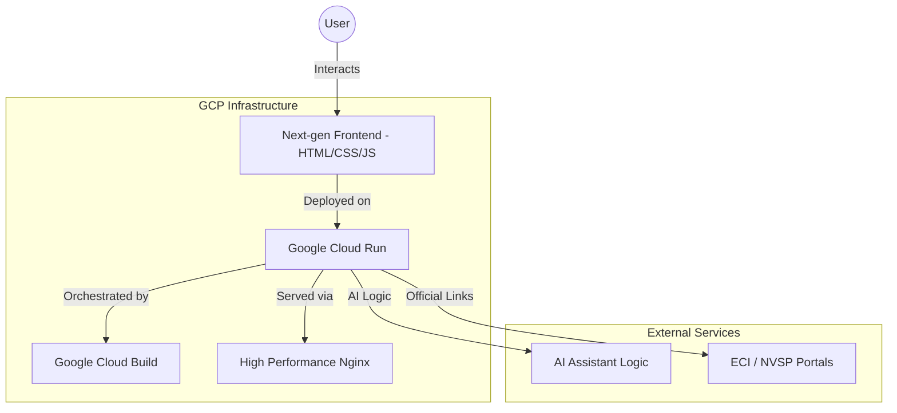

# 🗳️ Indian Election Assistant

> **Empowering every citizen with interactive knowledge about the world's largest democratic process.**

[](https://election-assistant-167474433419.us-central1.run.app)
[](https://github.com/MdFaisalDevops/My-Voter-App)
[](https://opensource.org/licenses/MIT)

## 🌟 Overview

The **Indian Election Assistant** is a premium, interactive educational platform designed to guide Indian citizens through the complexities of the electoral system. From registration steps to polling day procedures, this assistant provides a one-stop-shop for all election-related queries with a focus on **User Experience (UX)**, **Accessibility**, and **Visual Excellence**.

---

## 🛠️ Key Features

| Feature | Description |
| :--- | :--- |
| **🤖 AI Chat Assistant** | A Gemini-inspired chat interface providing instant answers to complex electoral questions. |
| **📚 Interactive Flashcards** | 60+ cards with 3D flip animations to learn key terms and constitutional articles. |
| **🧠 Knowledge Quiz** | 80+ MCQ questions with detailed explanations and achievement certificates. |
| **🗺️ Voter Journey Wizard** | A step-by-step 8-stage interactive guide mapping the voter's lifecycle. |
| **📅 Election Timeline** | A vertical, interactive timeline of the entire election schedule from announcement to results. |
| **📞 Helpline Directory** | Searchable directory for national (1950) and state-wise Chief Electoral Officer contacts. |
| **♿ Accessibility Panel** | Toggles for font sizing and high-contrast mode for inclusive usage. |

---

## 🏗️ Architecture



---

## 🚀 Tech Stack

- **Frontend**: Vanilla HTML5, CSS3 (Rich Aesthetics, Glassmorphism), Modern ES6+ JavaScript.
- **Serving**: Nginx (High performance, Security Headers, Gzip).
- **Deployment**: Google Cloud Run (Serverless, Auto-scaling).
- **CI/CD**: Google Cloud Build & Artifact Registry.
- **Design System**: Custom HSL-based dark mode theme with rich micro-animations.

---

## 📦 Project Structure

```text
f:/My-voter-app/
├── index.html       # Main application shell & structure
├── styles.css      # Custom design system & animations
├── app.js          # Core logic, routing, and interactivity
├── data.js         # Comprehensive dataset (Flashcards, Quizzes, FAQs)
├── Dockerfile      # Production container definition
├── nginx.conf      # Optimized web server configuration
└── README.md       # Project documentation
```

---

## 💻 Local Development

1. **Clone the repository**:
   ```bash
   git clone https://github.com/MdFaisalDevops/My-Voter-App.git
   cd My-Voter-App
   ```

2. **Run a local server**:
   You can use any static file server. For example, using Python:
   ```bash
   python -m http.server 8080
   ```
   Or using Node.js:
   ```bash
   npx serve .
   ```

3. **Access the app**:
   Open `http://localhost:8080` in your browser.

---

## ☁️ Deployment to GCP Cloud Run

The project is pre-configured for a zero-downtime deployment to Google Cloud Run.

```bash
# 1. Login to gcloud
gcloud auth login

# 2. Set your project
gcloud config set project [YOUR_PROJECT_ID]

# 3. Build and push image
gcloud builds submit --tag gcr.io/[YOUR_PROJECT_ID]/election-assistant

# 4. Deploy to Cloud Run
gcloud run deploy election-assistant \
  --image gcr.io/[YOUR_PROJECT_ID]/election-assistant \
  --platform managed \
  --region us-central1 \
  --allow-unauthenticated
```

---

## 🛡️ Security & Best Practices

- **Security Headers**: X-Frame-Options, X-Content-Type-Options, and XSS Protection enabled via Nginx.
- **Performance**: Gzip compression and static asset caching implemented.
- **Responsive**: Fully responsive design for Mobile, Tablet, and Desktop.
- **Clean Code**: Modular JavaScript with a clear separation of data and logic.

---

## 📄 License

Distributed under the MIT License. See `LICENSE` for more information.

---

**Developed with ❤️ for Indian Citizens.**
